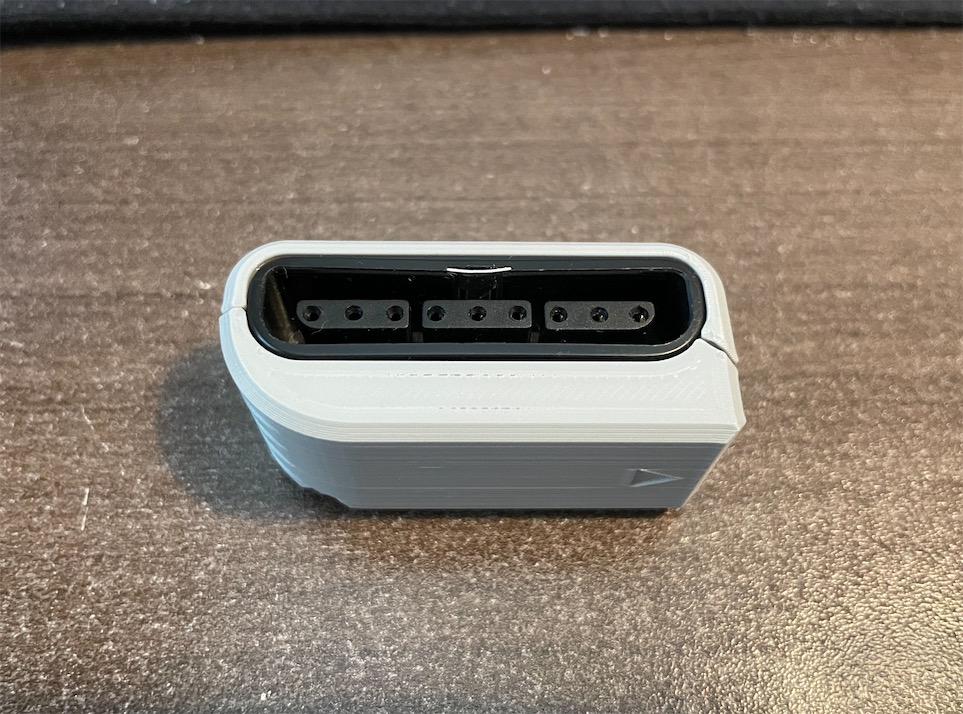
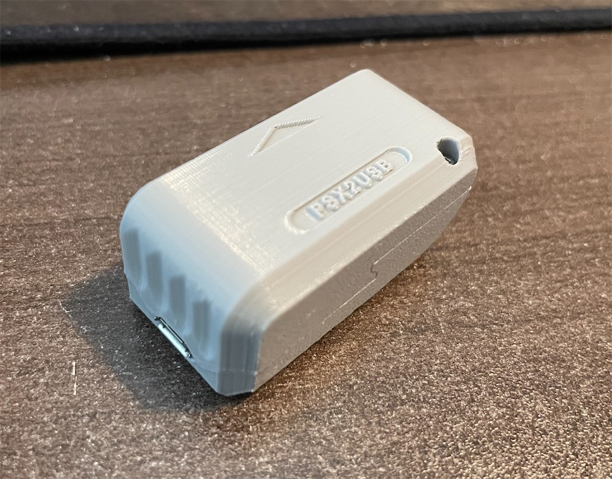
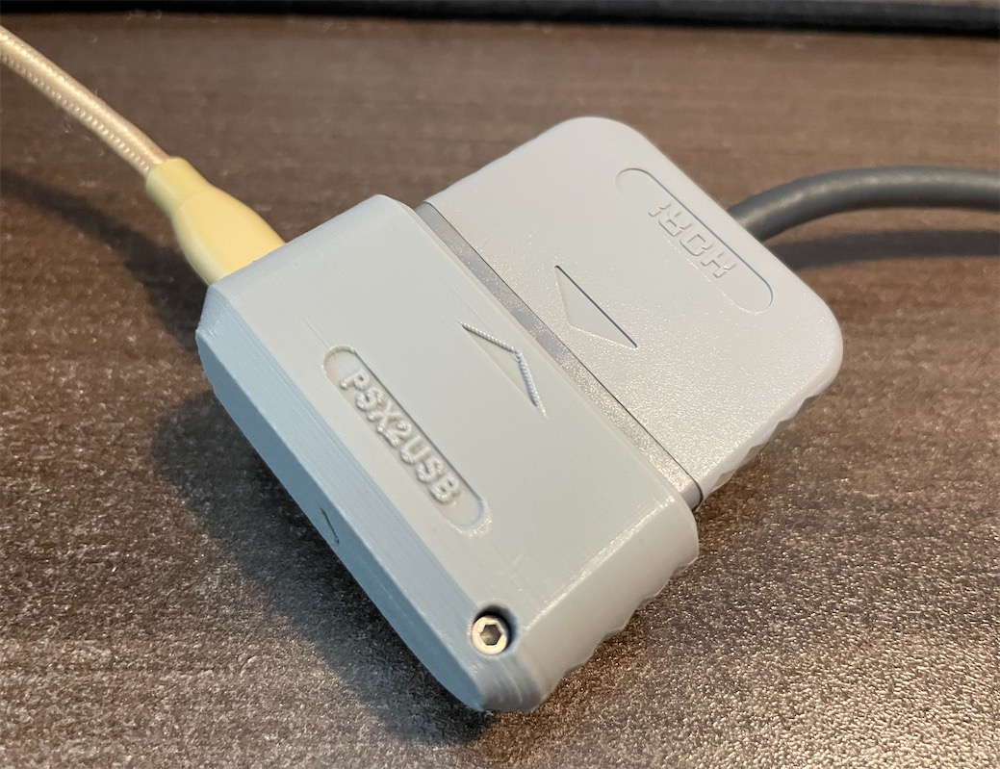
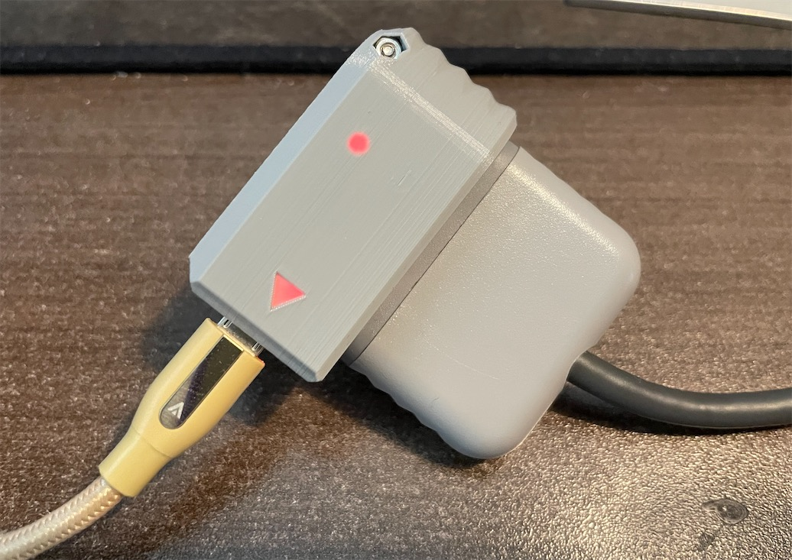
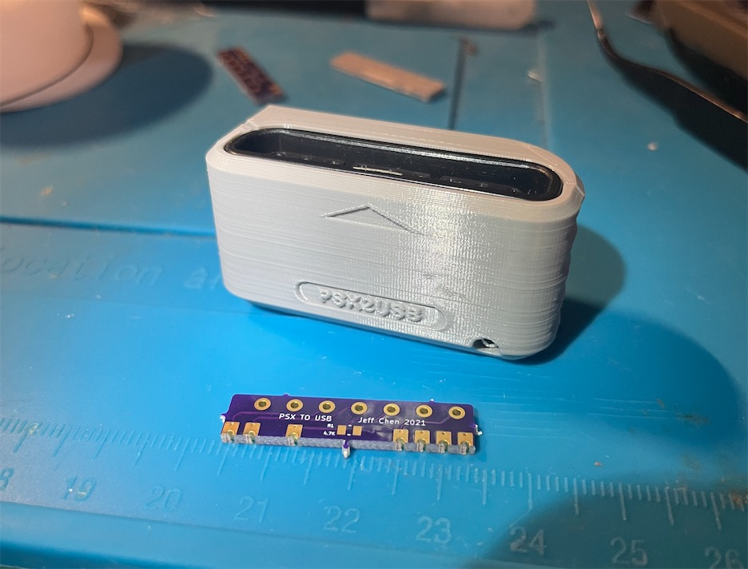
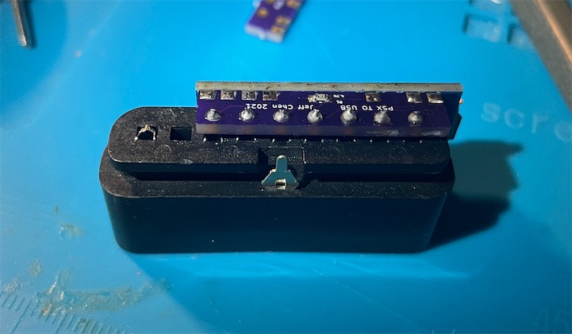
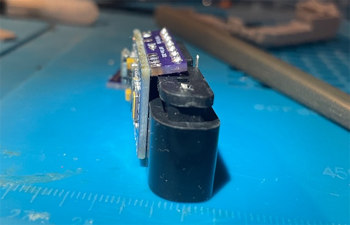
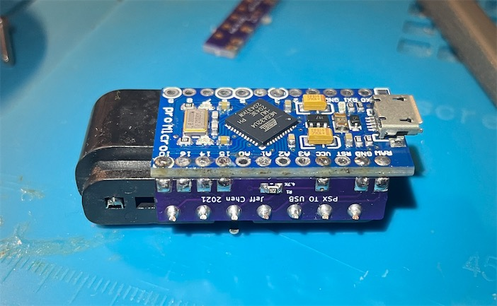

# PSX2USB_hardware

This is my iteration of a PSX to USB controller adapter. It uses an Arduino Pro Micro as the micro controller. The 3D printed shell packs everything very tight together. Important LEDs shine through hidden windows on the shell.

-------------
## Parts

- [PCB](https://oshpark.com/shared_projects/5XfiUruJ)

- PlayStation Controller Port - [Link](https://github.com/jeffqchen/JeffParts/blob/main/Connectors/PlayStation%20Controller%20Port/info.md)

- Arduino Pro Micro (Preferably 3.3V version) - [Link](https://github.com/jeffqchen/JeffParts/blob/main/Board/Arduino/Pro%20Micro/3.3V%208MHz/info.md)

- [1x] M2x12 Hex screw & nut - [Link](https://github.com/jeffqchen/JeffParts/blob/main/Parts/M2%20M3%20Hex%20Screw%20%26%20Nut/info.md)

- [1x] 0603 size 4.7K SMD resistor

-------------

## Printing

Print the two sides upright with support. That's it.

-------------

## Assembly

Snip off pin 9 flush from the PSX controller plug.

Solder the 4.7K 0603 resistor onto the PCB.

The connection between the Arduino and the PCB is through castellated holes. They are a bit tricky to solder.

Lightly tin both sides of the castellated holes and pads on the PCB before hand. Then, slide the PCB onto the controller plug (mind the orientation, the 4.7K resistor should be visible), then solder the PCB onto the plug, as close as possible to the root of the pins.

Snap the assembly into the 3D-printed plug side part. Put a piece of thin double-sided tape on the exposed side of the plug, then put the Arduino in place.

Then, feed solder into the corresponding holes on the Arduino, while watching when the castelled holes on the PCB start to wet/melt. That indicates the solder has connected. Becareful not to melt the 3D printed shell. Don't heat things up for too long in one go.

Remember to test continuity of these joints with a multimeter before closing up.

-------------

## Software

Find information about the software portion in this repo:
https://github.com/jeffqchen/PSX2USB_software

-------------

Shield: [![CC BY-SA 4.0][cc-by-sa-shield]][cc-by-sa]

This work is licensed under a
[Creative Commons Attribution-ShareAlike 4.0 International License][cc-by-sa].

[![CC BY-SA 4.0][cc-by-sa-image]][cc-by-sa]

[cc-by-sa]: http://creativecommons.org/licenses/by-sa/4.0/
[cc-by-sa-image]: https://licensebuttons.net/l/by-sa/4.0/88x31.png
[cc-by-sa-shield]: https://img.shields.io/badge/License-CC%20BY--SA%204.0-lightgrey.svg
